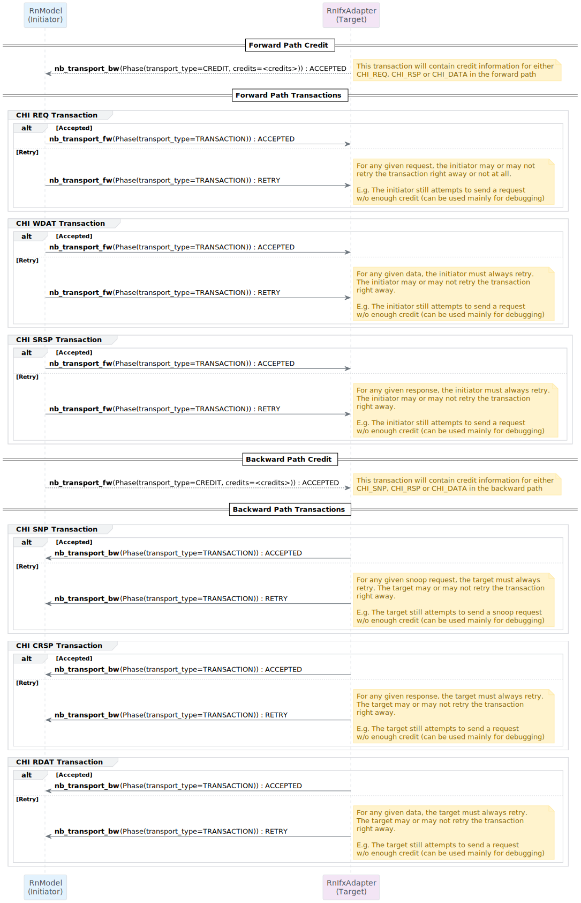

# Cycle Accurate SystemC Translator Libraries for AMBA CHI (chronos/amba_chi)

## RnIfxAdapter block diagram

## SnIfxAdapter block diagram

## TLM Phase and sync_enum class diagram

## RN TLM Transactions sequence diagram

## SN TLM Transactions sequence diagram

